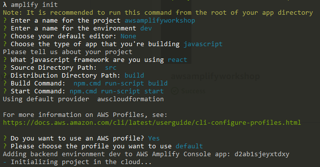
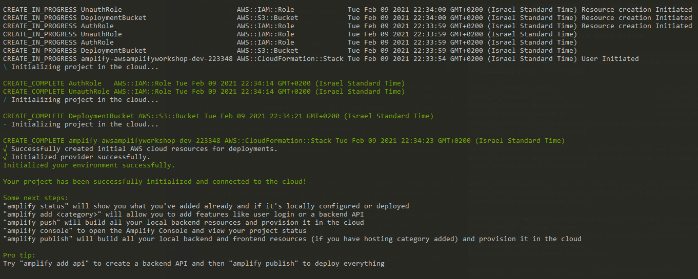

# 2. Init Amplify project

_AWS Amplify is a set of tools and services that can be used together or on their own, to help front-end web and mobile developers build scalable full stack applications, powered by AWS. With Amplify, you can configure app backends and connect your app in minutes, deploy static web apps in a few clicks, and easily manage app content outside the AWS console._

_Amplify supports popular web frameworks including JavaScript, React, Angular, Vue, Next.js, and mobile platforms including Android, iOS, React Native, Ionic, Flutter (Preview). Get to market faster with AWS Amplify._
````
amplify init
````
Select configuration



Create amplify project process will now start in Amazon



Once project created,
we can notice that we have new folder under our root directory called _amplify_
and new aws config file src/aws-exports.js
````javascript
/* eslint-disable */
// WARNING: DO NOT EDIT. This file is automatically generated by AWS Amplify. It will be overwritten.

const awsmobile = {
    "aws_project_region": "us-east-1"
};


export default awsmobile;
````
_This file will update each feature we will add to the project_

#### Add amplify to code

Install aws-amplify library
````
$ npm i aws-amplify
````
Import aws-exports configuration and init Amplify

src/index.js
```javascript
import React from 'react';
import ReactDOM from 'react-dom';
import App from './App';
// Amplify
import Amplify from 'aws-amplify';
import config from './aws-exports';

Amplify.configure(config);

ReactDOM.render(
  <React.StrictMode>
    <App />
  </React.StrictMode>,
  document.getElementById('root')
);
```

## Next: [3. Add GraphQL API](https://github.com/amitznati/aws-amplify-workshop/tree/master/3-Add%20GraphQL%20API#3-add-graphql-api)
