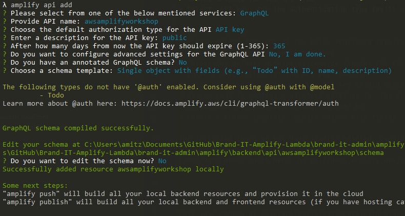
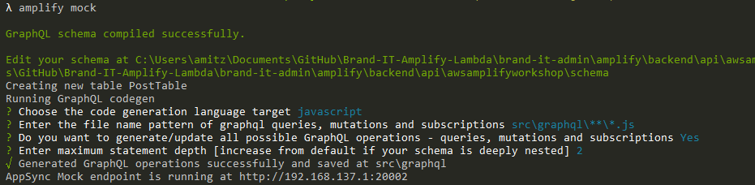

# 3. Add GraphQL Api

_GraphQL is a data language that was developed to enable apps to fetch data from APIs. It has a declarative, self-documenting style. In a GraphQL operation, the client specifies how to structure the data when it is returned by the server. This makes it possible for the client to query only for the data it needs, in the format that it needs it in._
````
amplify add api
````
* Select GraphQL for the API type
* Select _API key_ for the authentication type (we'll add additional authentication type in the next steps)



Once the API created we can now edit the data schema, 
go to: amplify/backend/api/awsamplifyworkshop/schema.graphql

Change the default schema, define Post model
````graphql
type Post
@model
@auth(rules: [{allow: public}])
{
    id: ID!
    title: String!
    body: String
}
````

_by adding @model annotation amplify will create for us queries, mutations and subscriptions_

_we're setting the authentication as public (anyone can read/write), we'll enhance it when we'll add authentication_

#### Testing the API

Enhance PostsList widget to retrieve posts from the API

Import API and listPosts query
```javascript
import {API} from 'aws-amplify';
import {listPosts} from './graphql/queries';
```
Retrieve posts from the API
````javascript
function PostsList() {
  const [posts, setPosts] = React.useState([]);
  React.useEffect(() => {
    // Calling the API with listPosts query
    API.graphql({query: listPosts}).then(response => {
      // Setting posts from response
      setPosts(response.data.listPosts.items);
    });
  }, []);
  
  return (
    <>
      {posts.map((post) => (
        <div key={post.id}>
          <h3>{post.title}</h3>
          <div>{post.body}</div>
        </div>
      ))}
    </>

  );
}
````

Enhance CreatePost widget to integrate with API

Import createPost mutation
````javascript
import {createPost} from './graphql/mutations';
````
Change onSubmit
````javascript
function CreatePost() {
  // ...
  const onSubmit = e => {
    e.preventDefault();
    if (!(newPost.title && newPost.body)) return;
    API.graphql({
      query: createPost,
      variables: {input: newPost},
    }).then(res => {
      setNewPost({title: '', body: ''});
      console.log(res);
    });
  }
  // ...
}
````

#### Running mock API

We can test the API before deploy it to cloud, run:
````
amplify mock
````


Open another terminal and run
```
npm start
```

After test done, we can now deploy the API, run:
````
amplify push
````
````
λ amplify push
√ Successfully pulled backend environment dev from the cloud.

Current Environment: dev

| Category | Resource name      | Operation | Provider plugin   |
| -------- | ------------------ | --------- | ----------------- |
| Api      | awsamplifyworkshop | Create    | awscloudformation |
? Are you sure you want to continue? Yes

GraphQL schema compiled successfully.

Edit your schema at C:\Users\amitz\Documents\GitHub\aws-amplify-workshop\amplify\backend\api\awsamplifyworkshop\schema.graphql or place .graphql files in a directory at C:\Users\amitz\Documents\GitHub\aws-amplify-workshop\amplify\backend\api\awsamplifyworkshop\schema
? Do you want to update code for your updated GraphQL API Yes
? Do you want to generate GraphQL statements (queries, mutations and subscription) based on your schema types?
This will overwrite your current graphql queries, mutations and subscriptions Yes
````
Process to deploy the API to Amazon cloud will start, in the end you should see:
````
...
√ Generated GraphQL operations successfully and saved at src\graphql
√ All resources are updated in the cloud

GraphQL endpoint: https://xxxxxxxxxxxxxxxxxx.appsync-api.us-east-1.amazonaws.com/graphql
GraphQL API KEY: xxx-xxxxxxxxxxxxx
````
We can view the API data, queries, configuration etc. in Amazon [AppSync](https://console.aws.amazon.com/appsync/home?region=us-east-1#/apis)

## Next: [4. Add Authentication](https://github.com/amitznati/aws-amplify-workshop/tree/master/4-Add%20Authentication#4-add-authentication)
