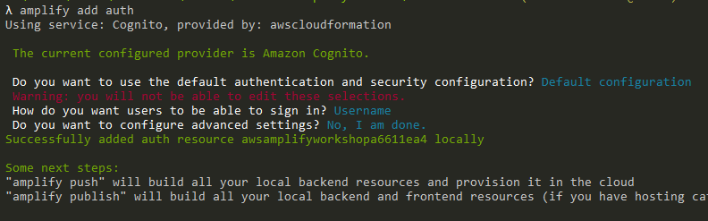
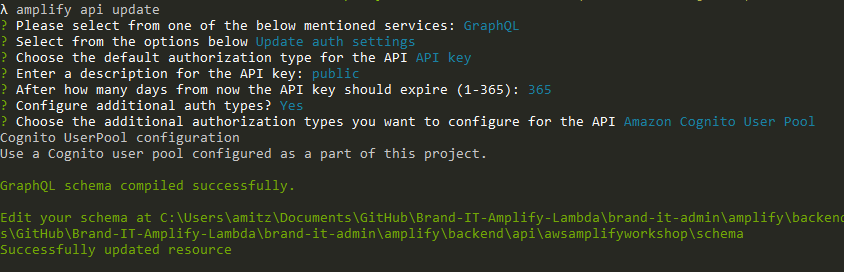

# 4. Add Authentication

### Authentication with Amplify
The Amplify Framework uses Amazon Cognito as the main authentication provider. Amazon Cognito is a robust user directory service that handles user registration, authentication, account recovery & other operations. In this tutorial, you’ll learn how to add authentication to your application using Amazon Cognito and username/password login.
````
amplify add auth
````
Select _Default configuration_ and _Username_ for sign in method



Deploy the change
```
amplify push
```
````
λ amplify push
√ Successfully pulled backend environment dev from the cloud.

Current Environment: dev

| Category | Resource name              | Operation | Provider plugin   |
| -------- | -------------------------- | --------- | ----------------- |
| Auth     | awsamplifyworkshopc4bf374f | Create    | awscloudformation |
| Api      | awsamplifyworkshop         | No Change | awscloudformation |
? Are you sure you want to continue? Yes
\ Updating resources in the cloud. This may take a few minutes...
....
....
√ All resources are updated in the cloud
````

### Use the Authentication

Wrap the CreatPost widget with _AmplifyAuthenticator_ so that only sign in users can access the widget

Install Amplify UI React library
````
npm install @aws-amplify/ui-react
````
import AmplifyAuthenticator
````javascript
import {AmplifyAuthenticator} from '@aws-amplify/ui-react';
````
Wrap CreatePost with authentication
````javascript
function CreatePost() {
  ...
  return (
    <AmplifyAuthenticator>
      <form onSubmit={onSubmit}>
        ...
      </form>
    </AmplifyAuthenticator>
  );
}
````
Now when running the application we should see this Amplify sign in form instead of CreatePost widget


#### Users can now sign up and sign in to the application

### Connect the user to the post and restrict access for guests

Update the API authentication settings
````
amplify api update
````
Keep existing settings (service _GraphQL_, auth type _API key_), select _Yes_ for adding additional auth type and select _Amazon Cognito User Pool_



Enhance the Post model schema with auth configuration as so:
amplify/backend/api/awsamplifyworkshop/schema.graphql
```graphql
type Post
@model
@auth(rules: [
  {allow: public, operations: [read]},# public access for read
  {allow: owner, ownerField: "username"}, # full access to owner, owner mapped by username field
])
# adding query to the model to retrieve posts by username
@key(name: "postByUsername", fields: ["username"], queryField: "postByUsername")
{
  id: ID!
  title: String!
  body: String
  username: String # adding username field
}
```
Change CreatePost::onSubmit to map the username to the post by adding single prop to the API
````javascript
authMode: 'AMAZON_COGNITO_USER_POOLS'
````
```javascript
const onSubmit = e => {
    e.preventDefault();
    if (!(newPost.title && newPost.body)) return;
    API.graphql({
      query: createPost,
      variables: {input: newPost},
      authMode: 'AMAZON_COGNITO_USER_POOLS'
    }).then(res => {
      setNewPost({title: '', body: ''});
      console.log(res);
    });
  }
```

Deploying the changes
````
amplify push
````
````
λ amplify push
√ Successfully pulled backend environment dev from the cloud.

Current Environment: dev

| Category | Resource name              | Operation | Provider plugin   |
| -------- | -------------------------- | --------- | ----------------- |
| Api      | awsamplifyworkshop         | Update    | awscloudformation |
| Auth     | awsamplifyworkshopc4bf374f | No Change | awscloudformation |
? Are you sure you want to continue? Yes

GraphQL schema compiled successfully.

Edit your schema at C:\Users\amitz\Documents\GitHub\aws-amplify-workshop\amplify\backend\api\awsamplifyworkshop\schema.graphql or place .graphql files in a directory at C:\Users\amitz\Documents\GitHub\aws-amplify-workshop\amplify\backend\api\awsamplifyworkshop\schema
? Do you want to update code for your updated GraphQL API Yes
? Do you want to generate GraphQL statements (queries, mutations and subscription) based on your schema types?
This will overwrite your current graphql queries, mutations and subscriptions Yes
| Updating resources in the cloud. This may take a few minutes...
...
...
...
√ Generated GraphQL operations successfully and saved at src\graphql
√ All resources are updated in the cloud

GraphQL endpoint: https://xxxxxxxxxxxxxxxxxxxx.appsync-api.us-east-1.amazonaws.com/graphql
GraphQL API KEY: xxx-xxxxxxxxxxxxxxxxxxxxxxxx
````

## Next: [5. Add Storage](https://github.com/amitznati/aws-amplify-workshop/tree/master/5-Add%20Storage#5-add-storage)
