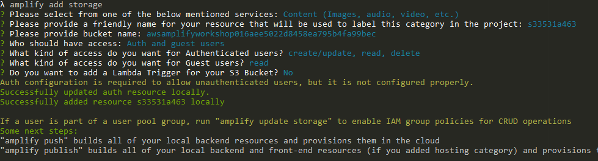

# 5. Add Storage

### Storage with Amplify
AWS Amplify Storage module provides a simple mechanism for managing user content for your app in public, protected or private storage buckets. The Storage category comes with built-in support for Amazon S3.

````
amplify add storage
````



Add postImage field to Post model
````graphql
type Post
@model
@auth(rules: [
  {allow: public, operations: [read]},
  {allow: owner, ownerField: "username"},
])
@key(name: "postByUsername", fields: ["username"], queryField: "postByUsername")
{
  id: ID!
  title: String!
  body: String
  username: String
  postImage: String
}
````

Deploying the changes
````
amplify push
````
```
λ amplify push
√ Successfully pulled backend environment dev from the cloud.

Current Environment: dev

| Category | Resource name              | Operation | Provider plugin   |
| -------- | -------------------------- | --------- | ----------------- |
| Storage  | awsworkshopresource        | Create    | awscloudformation |
| Api      | awsamplifyworkshop         | Update    | awscloudformation |
| Auth     | awsamplifyworkshopc4bf374f | Update    | awscloudformation |
? Are you sure you want to continue? Yes

GraphQL schema compiled successfully.

Edit your schema at C:\Users\amitz\Documents\GitHub\aws-amplify-workshop\amplify\backend\api\awsamplifyworkshop\schema.graphql or place .graphql files in a directory at C:\Users\amitz\Documents\GitHub\aws-amplify-workshop\amplify\backend\api\awsamplifyworkshop\schema
? Do you want to update code for your updated GraphQL API Yes
? Do you want to generate GraphQL statements (queries, mutations and subscription) based on your schema types?
This will overwrite your current graphql queries, mutations and subscriptions Yes
\ Updating resources in the cloud. This may take a few minutes...
...
...
...
√ Generated GraphQL operations successfully and saved at src\graphql
√ All resources are updated in the cloud

GraphQL endpoint: https://xxxxxxxxxxxxxxxxxxxxxx.appsync-api.us-east-1.amazonaws.com/graphql
GraphQL API KEY: xxx-xxxxxxxxxxxxxxxxxxxxxxxxxxx
```
### Using Storage
import Storage
```javascript
import {Storage} from 'aws-amplify';
```
Updating CreatePost with new image field

Add new State 
```javascript
const [image, setImage] = React.useState(null);
// on image change handler
const onImageChange = ({target: {validity, files: [file]}}) =>
    validity.valid && setImage(file);
```
Add new image input to the form
```javascript
<form onSubmit={onSubmit}>
  <div>
    ...
    <input type="file" name="postImage" accept="image/*" onChange={onImageChange} />
    ...
  </div>
</form>
```

Change onSubmit to handle the image upload
```javascript
const onSubmit = e => {
  e.preventDefault();
  if (!(newPost.title && newPost.body)) return;
  API.graphql({
    query: createPost,
    variables: {input: newPost},
    authMode: 'AMAZON_COGNITO_USER_POOLS'
  }).then(res => {
    const postId = res.data.createPost.id;
    // uploading the image to S3 Bucket
    Storage.put(
      `${postId}.${image.name.split('.').pop()}`,
      image,
      {contentType: image.type})
      .then(storageRes => {
        // updating postImage field with the S3 object key 
        API.graphql({
          query: updatePost,
          variables: {input: {id: postId, postImage: storageRes.key}},
          authMode: 'AMAZON_COGNITO_USER_POOLS'
        }).then(updatedPost => {
          setNewPost({title: '', body: ''});
        });
    });
  });
}
```

Display the image in PostsList

import AmplifyS3Image
```javascript
import {AmplifyS3Image} from '@aws-amplify/ui-react';
```
```javascript
function PostsList() {
  ...
  return (
    <>
      {posts.map((post) => (
        <div key={post.id}>
          <h3>{post.title}</h3>
          <div>{post.body}</div>
          {post.postImage &&
            <AmplifyS3Image imgKey={post.postImage} />
          }
        </div>
      ))}
    </>
  );
}
```

## Next: [6. Connect the storage to Amazon CloudFront](https://github.com/amitznati/aws-amplify-workshop/tree/master/6-Connect%20the%20storage%20to%20Amazon%20CloudFront#6-connect-the-storage-to-amazon-cloudfront)
