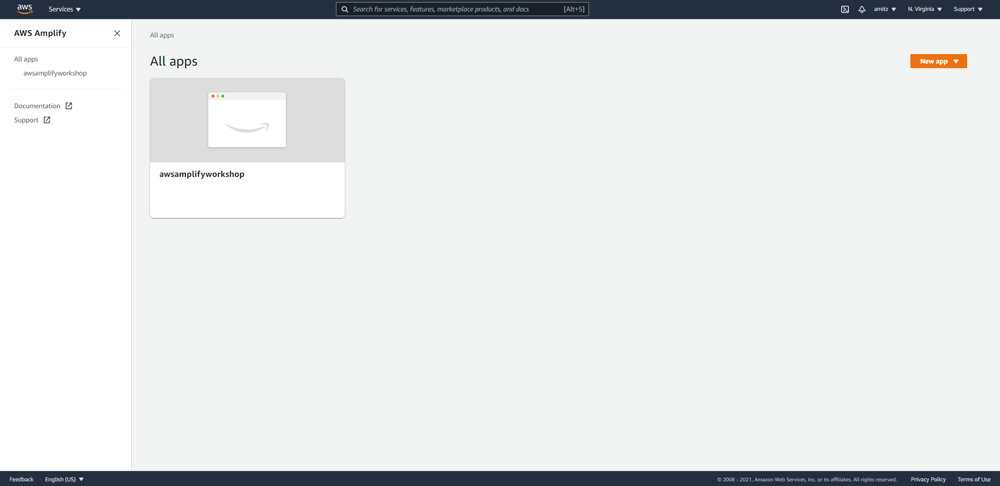
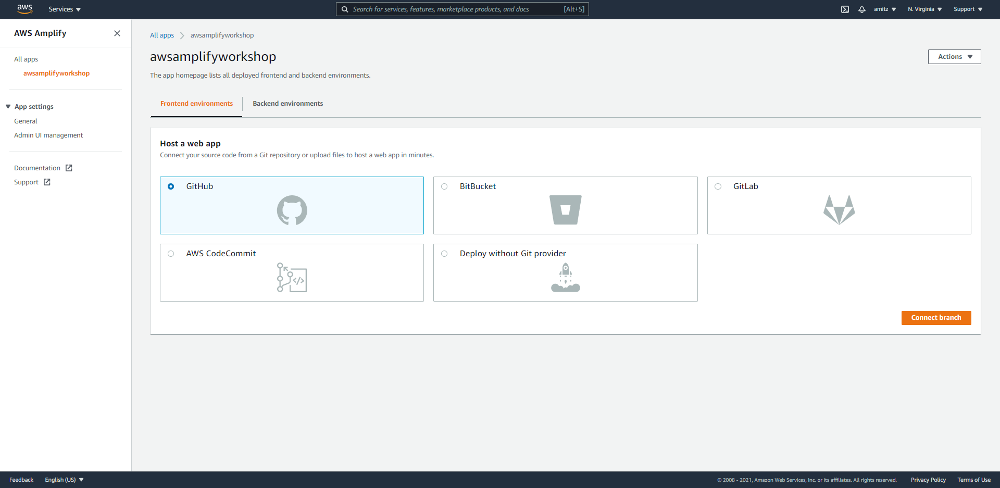
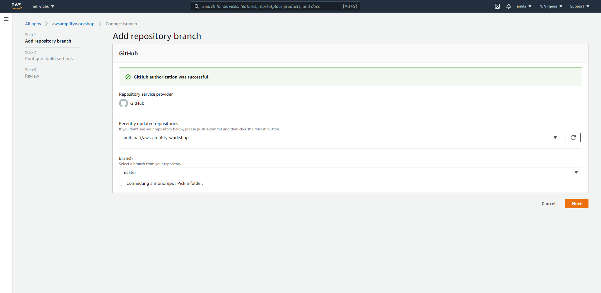
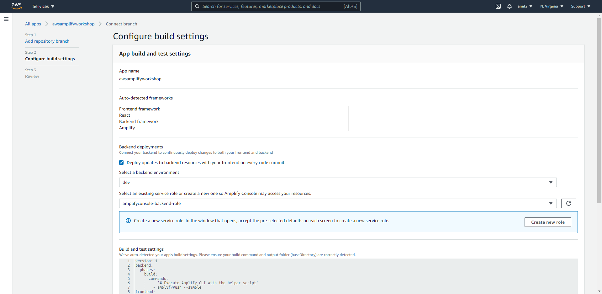
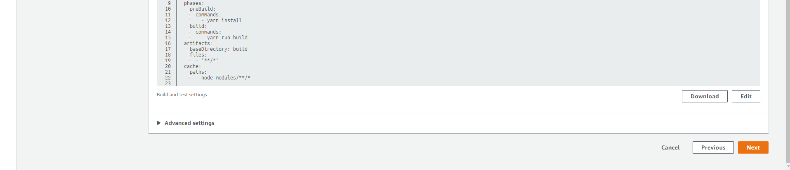
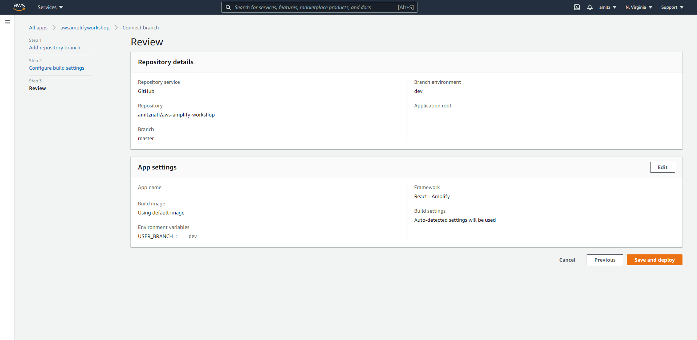
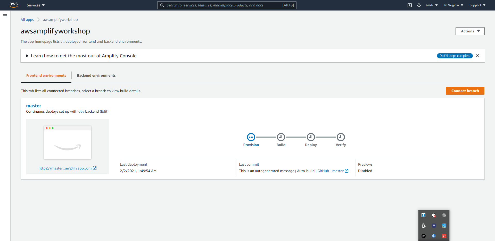
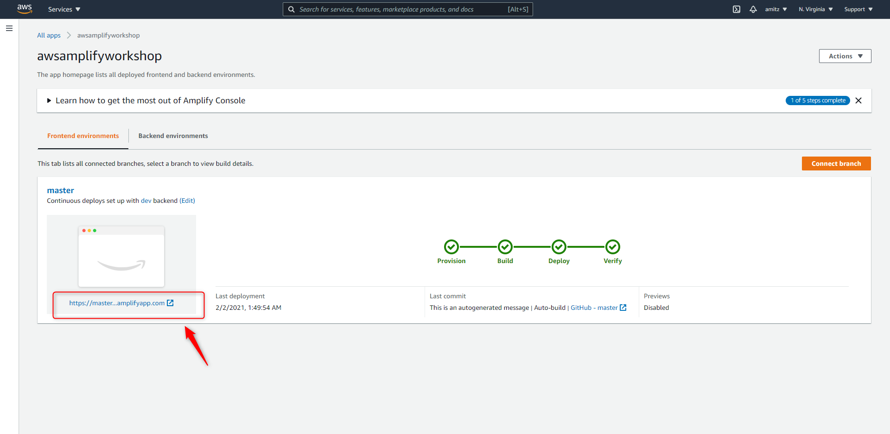
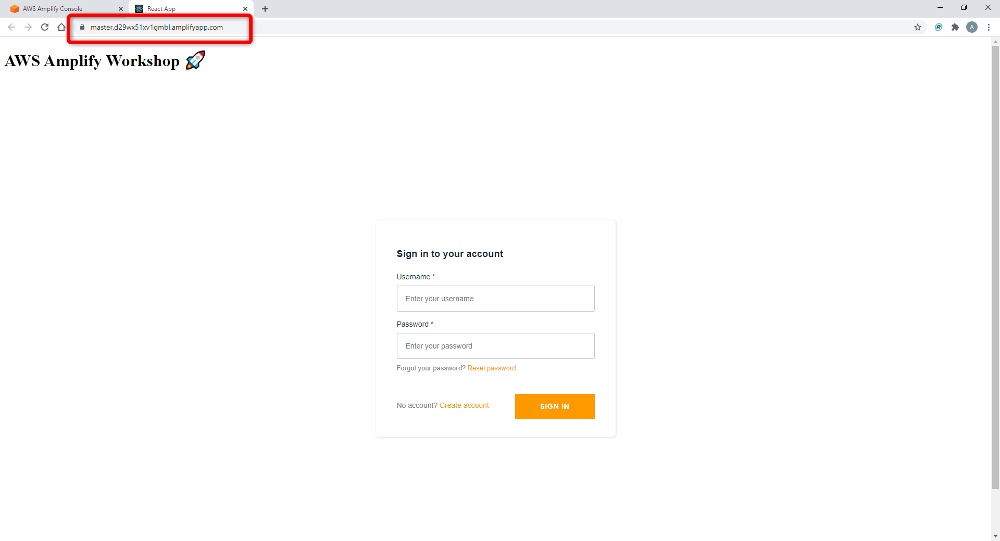

# 7. Hosting the client application on Amplify frontend

Deployment of the frontend application will be done in Amplify console

* #### Go Amplify console and select your application

  
* #### Select a GitHub application and click _connect branch_

  
* #### Select the application repository and branch and click _Next_

* #### Configure build settings

  make sure the _Auto-detected frameworks_ detect Amplify and we have _Backend deployments_ section, 
  select the env (dev) and create new _service role_.
  Click _Next_
  
* #### Review and click _Save and deploy_

* #### Deployment process will start

* #### After deployment done we can open the application from Amazon URL

# Our application is _app_ in the air 🚀

