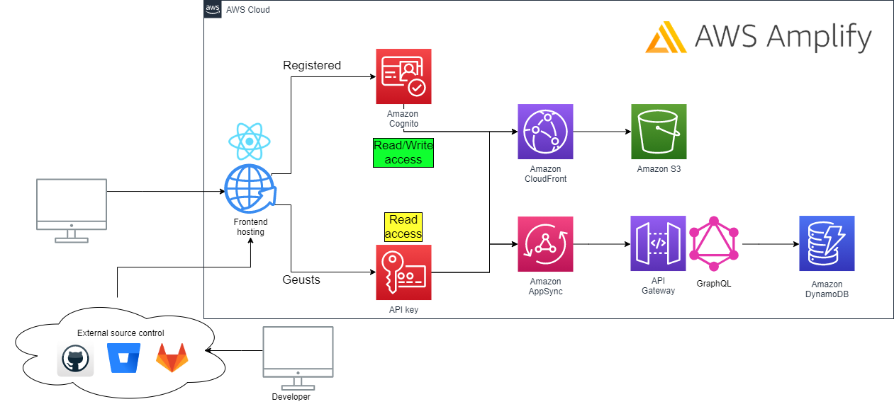
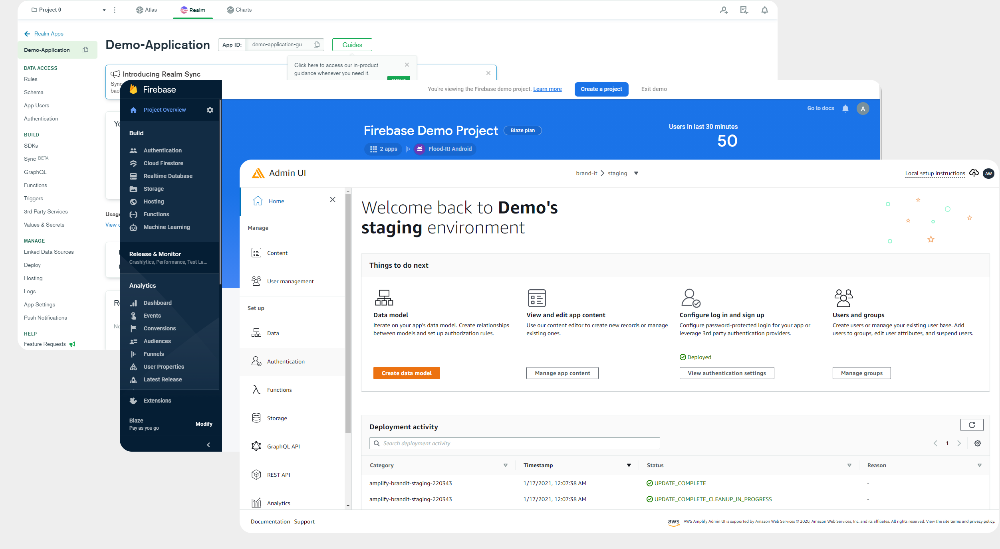

# Full stack application workshop with Amazon Amplify

Nowadays there a more companies that offering free full-stack architecture, ready to use within few clicks

those architectures often offer: Authentication,Storage, REST/GraphQL API, DB, Client hosting, cloud functions, notification service and more

i.e.
mongoDB Realm, Google Firebase, Amazon Amplify:

In this workshop there are steps to configure full stack infrastructure on Amazon cloud using [Amazon Amplify]()

by following the steps you'll be able to configure:

* **Amplify project** - backend project on Amazon cloud, with capabilities to add Amplify features such as API, Storage, Authentication etc. with secure connection between them.
* **API** - GraphQL API gateway with an auto generated queries, resolvers and subscriptions by defining GraphQL models schema. the API will be accessible for _READ_ by API key (guests users) and for _READ/WRITE_ by **Amazon Cognito** authentication (registered users).
* **Authentication** - Amazon Cognito User Pool - ready to use authentication service include full sign up-in flow, reset/forgot password, MFA process and more. to handle the authentication process views we'll use Amplify React UI library.
* **Storage** - Amazon CloudFront + Amazon S3 Bucket - 
